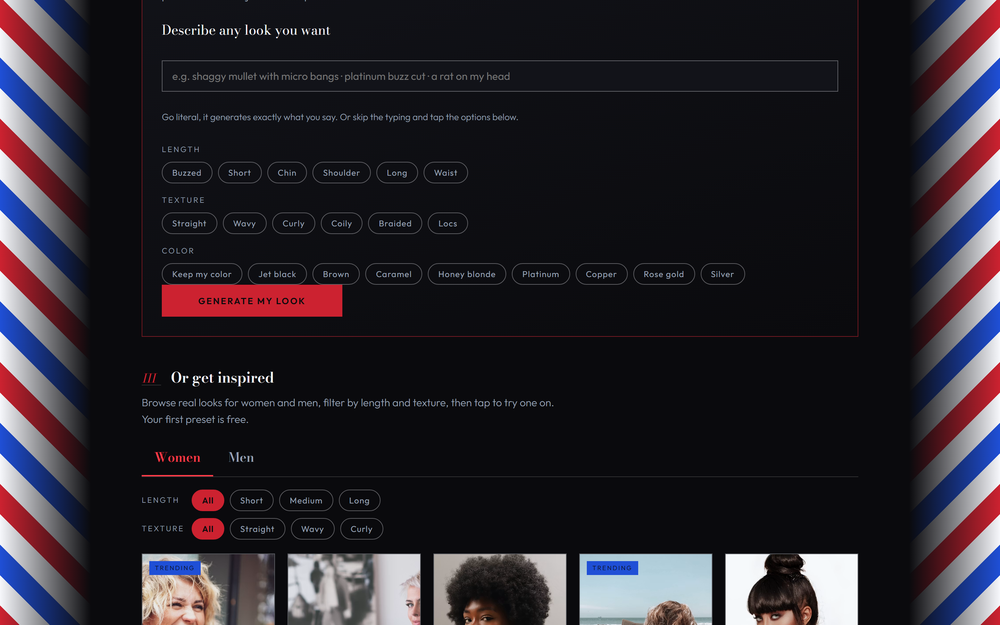

# Hairrison Studio 💈

> **Try the haircut before the haircut.**

Hairrison is an AI hairstyle preview, rebuilt as a real product. Upload a selfie, describe any look you can dream up, and see yourself in it (in a salon mirror) before you commit to the chair. The idea is simple: I've always wanted to know what a big change would actually look like on *me* before a barber makes it permanent. So I built the thing that answers that.

I also added Stripe payment (easier to setup than I expected)! So if you want to have unlimited usage or just send me a thank you donation for the service, pay me a toonie (+ tax).

🌐 **Live app:** [hairrison.vercel.app](https://hairrison.vercel.app/)
🎥 **v1 demo video:** [Watch on YouTube](https://youtu.be/vljrvV9sbSA)

🏆 I originally built this for Hack Canada 2026. This repo now holds **v2 ("Hairrison Studio")**, a ground-up rebuild. The original hackathon app is preserved in [`Hairrison/`](./Hairrison).




## What it does

1. **Upload a selfie** through the Cloudinary Upload Widget. It stays in your Cloudinary library.
2. **Build your own look** (this is the main event): type anything ("shaggy mullet with micro bangs," "platinum buzz cut," even "a rat on my head"), or assemble a look from length / texture / color chips. The prompt goes to Cloudinary almost word for word, so what you describe is what you get. It isn't restricted to hair, which is half the fun.
3. **Or get inspired** from the preset gallery: real reference photos for **Women** and **Men**, filterable by **length** (short / medium / long) and **texture** (straight / wavy / curly). Hover a look and tap **Try this look** to render it onto your photo.
4. **Mirror Compare**: drag the salon-mirror slider to sweep between before and after.
5. **Switch between generated looks** with result tabs, and **download** any one.
6. **Session history**: every look you make is saved locally and restorable from the film-strip rail.

## Pricing

Two **free tries** to start, no account, no card: one custom-prompt look and one preset look, so you can try both sides of it for free. After that, unlimited looks are a one-time **$1.99 unlock** via Stripe Checkout. No subscription, ever. Stripe emails your receipt at checkout. Support: chenyinwilliam@gmail.com.

## Architecture

```
├── v2/          Vite + React 19 + TypeScript (the app)
├── api/         Vercel serverless functions (Stripe)
│   ├── checkout.js   POST  → creates the $1.99 Checkout Session
│   ├── verify.js     GET   → verifies payment, mints an HMAC-signed license
│   └── webhook.js    POST  → records checkout.session.completed
└── Hairrison/   v1 (the Hack Canada 2026 original, preserved)
```

**The core engine** is Cloudinary Generative Replace. I keep prompts short and literal, with no extra text tacked on, because long comma-heavy prompts muddy the result:

```ts
cld.image(publicId)
  .effect(generativeReplace().from('hair').to(prompt))  // commas/slashes → spaces, whitespace collapsed
  .toURL();
```

**Entitlements** (two free credits, the dev-mode flag, and the license) all live in `localStorage`. Licenses are HMAC-signed server-side with `LICENSE_SECRET` and verified after Stripe redirects back with a `session_id`.

One thing I want to be upfront about: generation runs client-side through Cloudinary URLs, so the paywall is a **product gate, not a security boundary**. At $1.99, I think that's the right trade-off. I'd rather ship something honest and cheap than over-engineer a fortress around a two-dollar unlock.

## Setup

### 1. Cloudinary
- Create a free account and note your **cloud name**.
- Create an **unsigned upload preset** (Settings → Upload).
- Generative Replace needs a plan with the generative AI add-ons enabled.

### 2. Stripe
- Grab your secret key (`sk_test_...` to start).
- Add a webhook endpoint at `https://<your-app>/api/webhook` for the `checkout.session.completed` event, and note the `whsec_...` secret.

### 3. Environment

Copy `.env.example`. For local dev, put the `VITE_*` vars in `v2/.env`; for deployment, set everything in your Vercel project env vars:

```env
VITE_CLOUDINARY_CLOUD_NAME=your_cloud_name
VITE_CLOUDINARY_UPLOAD_PRESET=your_unsigned_preset
STRIPE_SECRET_KEY=sk_test_xxx
STRIPE_WEBHOOK_SECRET=whsec_xxx
LICENSE_SECRET=any-long-random-string
APP_URL=https://your-deployment.vercel.app
```

### 4. Run

```bash
npm install && npm install --prefix v2
npm --prefix v2 run dev        # app on :5173
vercel dev                     # or run app + api together
```

To deploy, `vercel` runs the root `vercel.json`, which builds `v2/` and exposes `api/`.

## Tech stack

React 19 · TypeScript · Vite · Cloudinary (Upload Widget + URL Gen SDK + Generative Replace) · Stripe Checkout · Vercel Serverless.

## Design

The look is dark and magazine-like: deep brown surfaces, thin brass lines, off-white text, an elegant serif font (Bodoni Moda) for headings over a clean sans-serif (Outfit) for everything else. The custom prompt builder leads; the preset gallery (reference photos from Unsplash) is there for inspiration, not as the main path. There's one bold element, the mirror slider, and everything else stays quiet.
